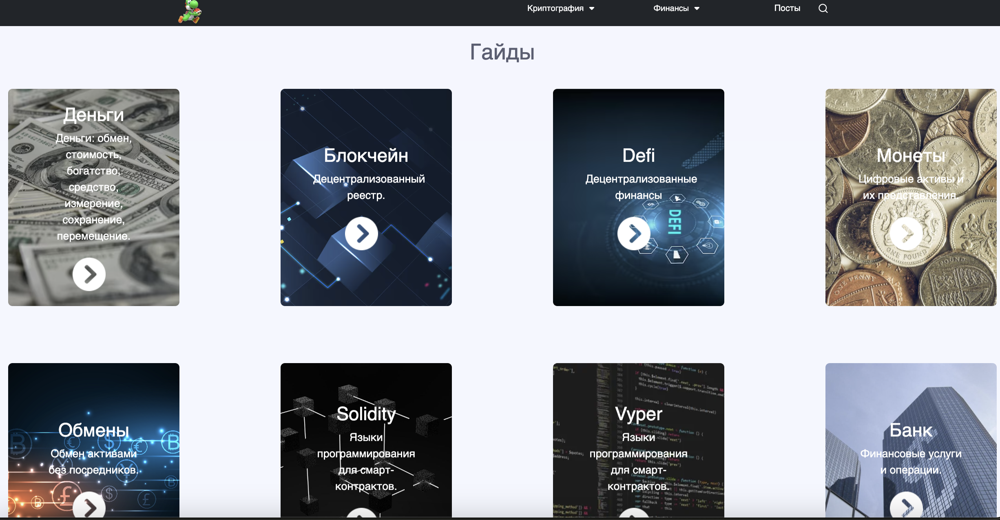
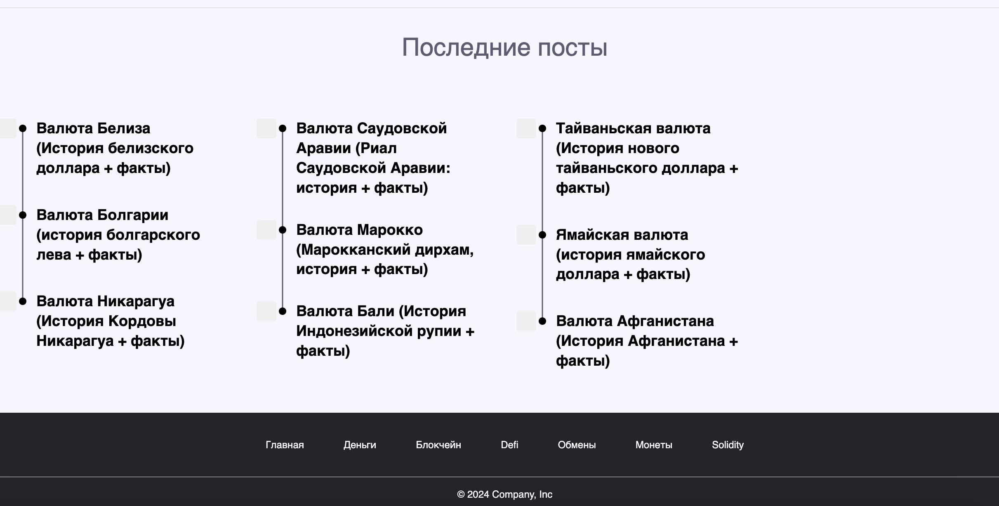

# CryptoCanvas

## О проекте

CryptoCanvas — это веб-приложение, разработанное для обучения и демонстрации основ криптовалюты. Приложение позволяет пользователям изучать различные аспекты криптовалют через интерактивный интерфейс.

## Технологии
Проект разработан с использованием следующих технологий:                      
- **Django**: веб-фреймворк для построения веб-приложений.
- **HTML/CSS**: для структуры и стилизации страниц.
- **JavaScript**: для интерактивности на клиентской стороне.

## Функциональность
- **Информация о криптовалютах**: Предоставляет базовую информацию о различных криптовалютах.
- **Визуализация данных**: Отображение графиков и аналитики, связанных с криптовалютами.
- **Обучающие материалы**: Разделы с обучающими материалами для начинающих.

## Установка и запуск
Для запуска проекта локально необходимо выполнить следующие шаги:
1. Клонируйте репозиторий:
git clone https://github.com/yourusername/cryptocanvas.git
2. Перейдите в директорию проекта:
cd cryptocanvas
3. Установите зависимости:
python manage.py runserver

## Как внести вклад
Мы приветствуем вклад всех желающих улучшить проект. Если вы хотите помочь, вы можете:
- Отправить pull request с улучшениями.
- Задать вопрос или предложить идею через систему issues на GitHub.
## Лицензия
Данный проект распространяется под лицензией MIT.

Важные моменты для доработки:

    Убедитесь, что ссылка на репозиторий GitHub актуальна и корректна.
    Добавьте более подробные описания функциональности, если она расширена.
    Настройте лицензию в соответствии с вашими предпочтениями.

